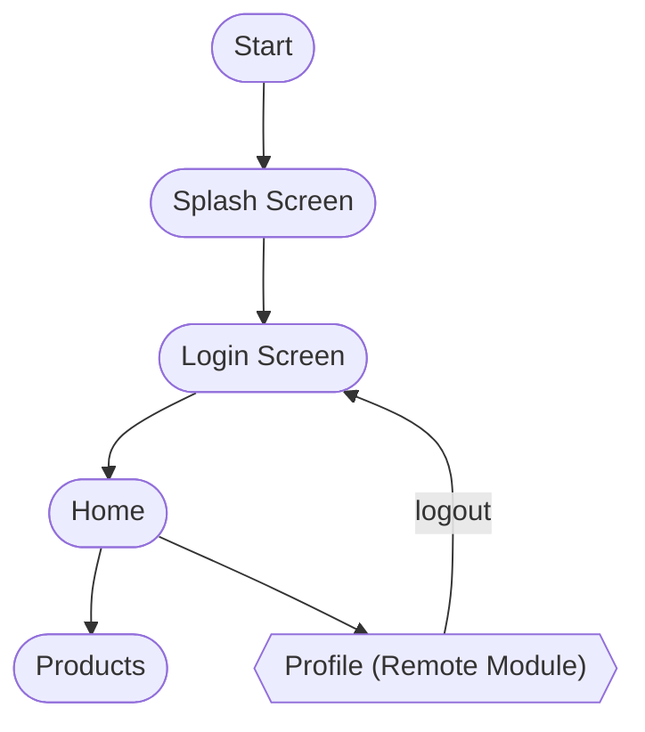
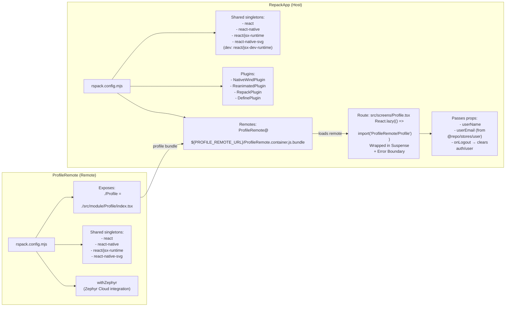

## Re.Pack Training

React Native monorepo demonstrating **Module Federation with Re.Pack (Rspack)**, using a host app (`RepackApp`) that dynamically loads a remote module app (`ProfileRemote`) over the network.

## Target

- Understand the definition of Re.Pack
- Understand the way Re.Pack works:
  - Micro Frontend
  - Code splitting
  - Custom bundling
- Apply [UI framework (Nativewind)](https://www.nativewind.dev/)
- Understand ow to configure and build applications for deployment on [Zephyr Cloud](https://zephyr-cloud.io/).
- Optimize the app’s bundle size

## Tech stacks

### Dev tools

- [Re.Pack](https://re-pack.dev/)

- [Turborepo](https://turborepo.com/)

- [React](https://react.dev/versions#react-19)

- [React Native](https://reactnative.dev/)

- [React Navigation](https://reactnavigation.org/docs/getting-started/)

- [Zustand](https://zustand.docs.pmnd.rs/getting-started/introduction)

- [React Query](https://tanstack.com/query/v5/docs/framework/react/overview)

- [Husky](https://typicode.github.io/husky/get-started.html)

- [Prettier](https://prettier.io/)

- [ESLint](https://eslint.org/)

### Programming Languages

- [TypeScript](https://www.typescriptlang.org/)

### UI Frameworks

- [Nativewind](https://www.nativewind.dev/)

### Editor

- [Cursor](https://cursor.com/)

## Prerequisites

Make sure you install packages with correct version below:

- [node v20.19.4](https://nodejs.org/en/download)
- [turbo ^2.7.5](https://turborepo.dev/)
- [pnpm v7.32.2](https://pnpm.io/)

## Structure

```
root
├── apps
│   ├── RepackApp/         # Host/container app that consumes remote modules
│   └── ProfileRemote/     # Remote app exposing a Profile screen via Module Federation
├── packages
│   ├── constants/         # API paths, messages, validation, storage keys
│   ├── hooks/             # Shared hooks (auth, products, theme, user,...)
│   ├── interfaces/        # Shared TypeScript types (auth, user, product,...)
│   ├── providers/         # Shared providers (React Query)
│   ├── services/          # Axios API client
│   ├── stores/            # Zustand stores (auth, user, theme)
│   ├── ui/                # Shared UI component library
│   ├── utils/             # Shared helpers (common, time)
│   ├── eslint-config/     # Shared ESLint config
│   └── typescript-config/ # Shared TS configs
├── .npmrc                 # pnpm configuration (dependency hoisting)
├── pnpm-lock.yaml         # pnpm lock file (dependency versions)
├── pnpm-workspace.yaml    # pnpm workspace configuration
└── turbo.json             # Turbo configuration
```

---

## Apps overview

### App's workflow



## Module Federation



---

## Installation & Running the apps

#### All commands are run from the root folder, from a terminal:

| Command                                                                  | Action                                         |
| :----------------------------------------------------------------------- | :--------------------------------------------- |
| `git clone git@gitlab.asoft-python.com:tien.nguyen/re-pack-training.git` | Download source code                           |
| `git checkout feat/flux-store`                                           | Move branch                                    |
| `pnpm install`                                                           | Installs dependencies                          |
| `pnpm dev` (from repo root)                                              | Start both Android dev servers (host + remote) |
| `pnpm dev:repack` (from repo root)                                       | Start only host dev server                     |
| `pnpm dev:profile` (from repo root)                                      | Start only remote dev server                   |
| `pnpm run dev:android` (from `apps/ProfileRemote`)                       | Metro dev server for Android (port 8082)       |
| `pnpm run android` (from `apps/ProfileRemote`)                           | Run Android app (connects to port 8082)        |
| `pnpm run build:bundle` (from `apps/ProfileRemote`)                      | Build bundle                                   |
| `pnpm run dev:android` (from `apps/RepackApp`)                           | Metro dev server for Android (port 8081)       |
| `pnpm run android` (from `apps/RepackApp`)                               | Run Android app (connects to port 8081)        |
| `pnpm run build:apk` (from `apps/RepackApp`)                             | Build release APK                              |

> **Note**: To test Module Federation end‑to‑end locally, you usually:
>
> - Run **ProfileRemote** locally and host its Rspack bundle
> - Point `RepackApp` remote URL to that local bundle (or to a deployed Zephyr URL).

## References

- [Re.Pack Documentation](https://re-pack.dev/docs/getting-started/quick-start)
- [Module Federation across Platforms](https://v4.re-pack.dev/docs/module-federation)
- [Zephyr Cloud](https://docs.zephyr-cloud.io/)
