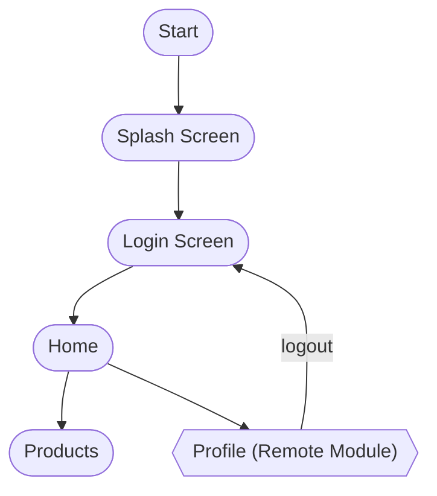

## RepackApp

## App's workflow



## Structure

```
RePackApp
├── android/               # Android-specific files
├── ios/                   # iOS-specific files
├── src/
│   ├── components/        # Reusable components
│   ├── types/             # TypeScript types
│   ├── navigation/        # Navigation configuration
│   └── screens/           # Screen components
├── .eslintrc.cjs          # ESLint configuration
├── .prettierrc            # Prettier configuration
├── app.json               # App configuration
├── App.tsx                # Main App component
├── babel.config.js        # Babel configuration
├── index.js               # ScriptManager resolver
├── jest.config.js         # Jest configuration
├── package.json           # Project dependencies
├── package.json           # Project dependencies
├── react-native.config.js # Custom configuration for React Native CLI
├── rspack.config.mjs      # Re.Pack + Rspack config
├── tailwind.config.cjs    # Tailwind config
└── tsconfig.json          # TypeScript configuration file
```

## Getting started

### Make sure you install packages with correct version below:

- node [v20.19.4](https://nodejs.org/en/download)
- pnpm [v7.32.2](https://pnpm.io/)

### Step by step to run this app in your local:

- Create an `.env` file in the root directory with environment values.

```bash
API_URL=
PROFILE_REMOTE_URL=
```

| Command                | Action                                   |
| :--------------------- | :--------------------------------------- |
| `pnpm run dev:android` | Metro dev server for Android (port 8081) |
| `pnpm run android`     | Run Android app (connects to port 8081)  |
| `pnpm run build:apk`   | Build release APK                        |

**Notes**:

- Before running npm start: create .env.local with .env.template (contact to me to get information of environment variable - Email: tien.nguyen@asnet.com.vn - Slack: tien.nguyen)

## References

- [Re.Pack Documentation](https://re-pack.dev/docs/getting-started/quick-start)
- [Module Federation across Platforms](https://v4.re-pack.dev/docs/module-federation)
- [React Native](https://reactnative.dev/)
- [Zephyr Cloud](https://docs.zephyr-cloud.io/)
